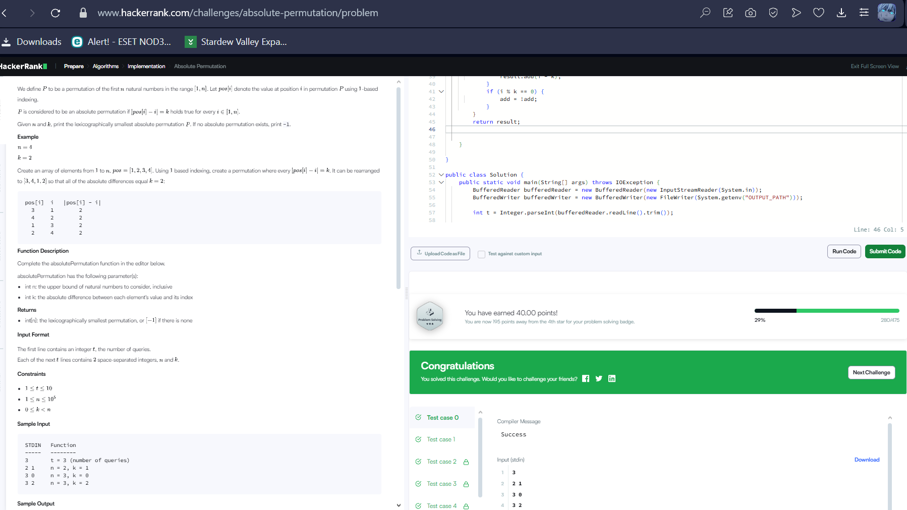

Absolute Permutation даалгаврыг биелүүлэхдээ хамгийн эхлээд нөхцөлүүдийг анхаарч үзсэн.

n болон k утгууд өгөгдөж байна. Хамгийн гол нь absolute permutation гэдэг нь i-тэй байрлал дээр ирж байгаа тоо j нь |i - j| = k байх ёстой гэсэн үг. Жишээ нь: n=4, k=2 бол 1-р байрлал дээр 3, 2-р байрлал дээр 4 ирнэ.

Хэрэв k = 0 бол permutation нь 1-с n хүртэл дараалсан тоонууд байна, яагаад гэвэл i ба j ижил байх шаардлагатай.

k > 0 бол бид блок болгон бодож, жишээ нь k=2 бол 2 тооны бүлгээр дараалал үүсгэнэ. Тухайн блок дотор i-р байрлал дээр i+k буюу i-k гэсэн утгууд байж болно.

Би дараах аргаар шийдсэн:

Блок хэмжээг k*2 гэж тогтооно.

1-с n хүртэл давталт хийж, блок бүрийн эхлэл хэсэгт (жишээ нь 1-р блокийн эхэнд) i+k-ийг байршуулна. Дараагийн k элементүүдэд i-k-г байршуулна. Энэ эргүүлэн сольж давталт явагдана.

Энэ арга нь зөвхөн n нь k-гийн үржвэр байвал ажиллана. Хэрэв үгүй бол absolute permutation байхгүй тул -1 буцаана.

Нэмж бичсэн кодын тайлбар:

BufferedReader болон BufferedWriter нь файлын оролт гаралтыг хурдан хийхэд ашиглагддаг.

main функц дотор t тооны тестийг уншиж байна. Тест бүрт n, k утгуудыг авч, absolutePermutation функцийг дуудаж үр дүнг авна.

Үр дүнг зайгаар тусгаарлаж хэвлэнэ.

absolutePermutation функц нь List буцаана, үүнд absolute permutation байхгүй үед -1 орсон нэг элементийн жагсаалт буцаана. Энэ нь шууд хэвлэгдэхэд тохиромжтой.

Дээрх арга нь тооны үржвэр, absolute difference дээр тулгуурласан үр ашигтай шийдэл юм.
k тэг бол бүхэлдээ 1-с n хүртэлх энгийн дараалал буюу permutation-г буцаана.

k 0-оос өөр бол эхлээд n тоо нь 2*k-ын үржвэр болох эсэхийг шалгана. Хэрэв үгүй бол боломжгүй гэж үзэж -1 буцаана.

Хэрэв боломжтой бол add гэсэн boolean хувьсагч ашиглан ээлжлэн тоонуудыг i+k эсвэл i-k болгож жагсаалтад нэмнэ.

i нь k-ийн үржвэр болгонд add-ыг сольж, ээлжлэн нэмэх ба хасах байрлалыг солих механизм ажиллана.

Ингэснээр i болон түүний байрлалыг солино гэсэн нөхцөлд |i - new_value| = k байх absolute permutation үүснэ.

Товчоор бол, бүлэглэсэн k хэмжээтэй хэсгүүдэд ээлжлэн i+k эсвэл i-k нэмэх үйлдлийг хийснээр даалгаврын шаардлагыг хангах permutation-ийг үүсгэж байна.

