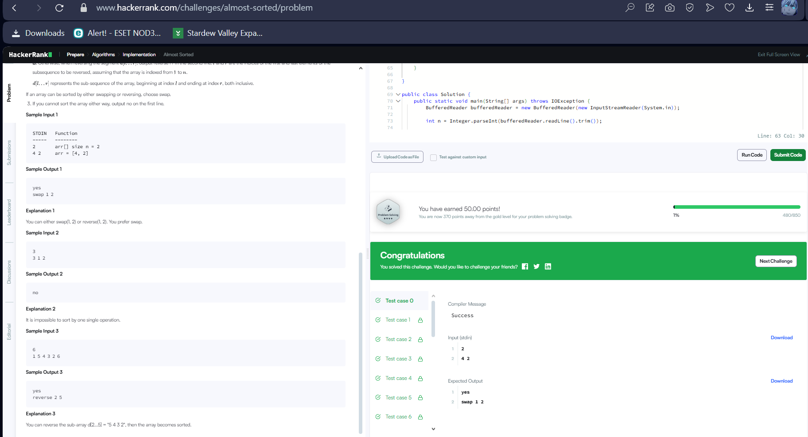

Тайлбар:

sortedArr гэж arr массивын хуулбарыг үүсгээд, үүнийг өсөх дарааллаар эрэмбэлнэ. Ингэснээр бид жинхэнэ зөв дараалалтай массивтай харьцуулах боломжтой болно.

Эхлээд arr массив аль хэдийнэ эрэмбэлэгдсэн эсэхийг шалгана. Хэрэв arr ба sortedArr ижил бол зөв дараалалтай гэсэн үг, yes гэж хэвлээд програмыг дуусгана.

left хувьсагчийг массивын эхнээс эхлэн анхны ялгаатай элемент хүртэл шилжүүлнэ. Энэ нь анхны өөрчлөгдсөн индекс болно.

right хувьсагчийг массивын төгсгөлөөс эхлэн анхны ялгаатай элемент хүртэл буцаан шилжүүлнэ. Энэ нь сүүлчийн өөрчлөгдсөн индекс болно.

arr массивын left болон right индекс дээрх элементүүдийг солиод (swap үйлдэл), солигдсон массивыг sortedArr массивтай харьцуулна. Хэрэв тэнцвэл:

yes гэж хэвлээд,

swap left+1 right+1 гэж хэвлэнэ. (1-ээс эхэлсэн индекс)

Хэрэв swap-аар зөв болохгүй бол, left-ээс right хүртэлх хэсгийг (subList) урвуугаар (reverse) эргүүлнэ. Дараа нь ийм массивыг sortedArr-тай харьцуулна. Хэрэв тэнцвэл:

yes гэж хэвлээд,

reverse left+1 right+1 гэж хэвлэнэ.

Эцэст нь ямар ч нэгэн үйлдэл массивыг зөв эрэмбэлж чадахгүй бол no гэж хэвлэнэ.

Энэ логик нь массивын аль нэг жижиг хэсгийг нэг удаа солих буюу эргүүлэх замаар зөв эрэмбэлэгдэж болох эсэхийг нарийвчлан шалгадаг. Swap ба reverse аль аль нь болбол swap-г илүүд үздэг.

Индексүүдийг 1-ээс эхэлж хэвлэдэг нь асуудлын шаардлага юм.
