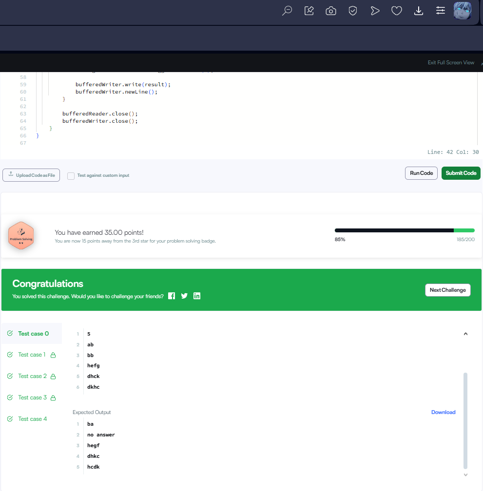

🧠 Тайлбар:
char[] chars = w.toCharArray();
Үгний тэмдэгтүүдийг массив болгож хувиргана.

int i = chars.length - 2;
Хамгийн баруунаас хоёр дахь байрлалаас эхлэн бууруулах чиглэлтэйгээр итерац эхлүүлнэ.

while (i >= 0 && chars[i] >= chars[i + 1]) i--;
Зүүнээс баруун тийш буурах дараалалтай хэсгийг хайна. Энэ нь хамгийн сүүлийн increasing point-ийг олох алхам юм.

if (i == -1)
Үг буурах дараалалтай байвал дараагийн том үг байх боломжгүй тул "no answer" буцаана.

int j = chars.length - 1; while (chars[j] <= chars[i]) j--;
Олдсон i-ийн баруун талын хамгийн жижиг боловч том утгатай тэмдэгтийг хайна.

char temp = chars[i]; chars[i] = chars[j]; chars[j] = temp;
Тэр хоёр тэмдэгтийн байрыг солино.

Arrays.sort(chars, i + 1, chars.length);
i-ээс хойших хэсгийг эрэмбэлж хамгийн бага дараагийн хувилбарыг олно.

return new String(chars);
Эцсийн үр дүнг string хэлбэрт буцаана.

🧾 Жишээ:
Input:
ab
Output:
ba

Input:
hefg
Output:
hegf

Input:
dcba
Output:
no answer

🧩 Дүгнэлт:
Энэ алгоритм нь "next lexicographically greater permutation" буюу тухайн үгнээс дараагийн хамгийн жижиг том хувилбарыг олох сонгодог аргачлал дээр суурилсан. Хамгийн баруунаас анхны бууралт олдсон цэгийг суурь болгож байр солих, дараа нь баруун хэсгийг өсөхөөр эрэмбэлэх зарчмаар ажилладаг.
