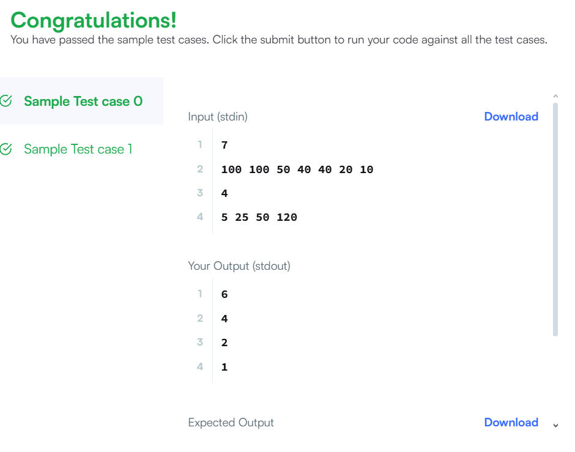

Дасгалын зорилго
Тоглогчийн оноог лийдэрбоард дээр хэддүгээр байранд орохыг олж мэдэх.

Юу хийх вэ?
Лийдэрбоард дээр давхардсан оноог хасна.
Учир нь нэг оноотой хүмүүс нэг байр эзэлдэг.
Жишээ: [100, 90, 90, 80] → [100, 90, 80]

Тоглогчийн оноог лийдэрбоардын жагсаалтаас харьцуулж байрлалыг олно.
Тоглогчийн оноо лийдэрбоардын хамгийн бага онооноос эхлэн дээшлээд, илүү оноотой бол байрлалыг дээшлүүлнэ.

Жишээ
Лийдэрбоард: [100, 90, 90, 80] → [100, 90, 80]

Тоглогчийн оноо: [70, 80, 105]

Үр дүн:

70 оноо → 4-р байр (лидэрбоардын хамгийн доор)

80 оноо → 3-р байр (80 оноотой тоглогчтой ижил байр)

105 оноо → 1-р байр (хамгийн өндөр оноо)

Кодны ажиллах зарчим
Лийдэрбоардын давхардсан оноог арилгаад жагсаана.

Тоглогчийн оноог хамгийн бага онооноос эхэлж харьцуулна.

Тоглогчийн оноо лийдэрбоардын онооноос их байвал нэг байр дээшлүүлнэ.

Ингэсээр тоглогч бүрийн байрлал тодорно.

public static List climbingLeaderboard(List ranked, List player) {
// Remove duplicates and sort descending
List distinctRanked = new ArrayList<>();
distinctRanked.add(ranked.get(0));
for (int i = 1; i < ranked.size(); i++) {
if (!ranked.get(i).equals(ranked.get(i - 1))) {
distinctRanked.add(ranked.get(i));
}
}

    List<Integer> result = new ArrayList<>();
    int index = distinctRanked.size() - 1;

    for (int score : player) {
        while (index >= 0 && score >= distinctRanked.get(index)) {
            index--;
        }
        result.add(index + 2);
    }

    return result;
}
}

