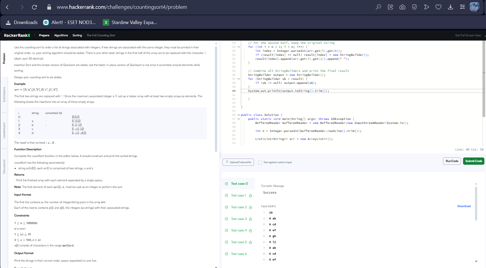

Ерөнхий зорилго:
Өгөгдсөн өгөгдлийн жагсаалтыг (жагсаалтад нь хоёр утга байна: индекс болон тэмдэгт) тоон утгаар нь эрэмбэлж, эхний хагасын тэмдэгтийг "-" болгож солих.

Ингэснээр тоон утгаар эрэмбэлэгдсэн дараалал гаргаж авах юм.

Алхам алхмаар тайлбар:
Хувилбар массив бэлтгэх:

StringBuilder[] result = new StringBuilder[n];
result массив нь StringBuilder-ийн массив бөгөөд индексүүд нь 0-с n-1 хүртэл байна.

Энэ массивын индекс нь оролтын өгөгдлийн тоон утга (индекс) -тай тэнцүү.

Үүнд тухайн тоон индексээр орж ирсэн тэмдэгтүүдийг дараалалтайгаар хадгалах үүрэгтэй.

Эхний хагасыг "-" тэмдэгтээр орлуулах:

for (int i = 0; i < n / 2; i++) {
int index = Integer.parseInt(arr.get(i).get(0));
if (result[index] == null) result[index] = new StringBuilder();
result[index].append("- ");
}
Жагсаалтын эхний хагасын элемент бүрийн тоон утгыг авч index болгож авна.

result массивын тухайн индекс дээр StringBuilder үүсгэж байгааг шалгана.

Хэрвээ байхгүй бол шинэ StringBuilder үүсгэнэ.

Тэгээд тухайн индекс дээр "- " тэмдэгтийг нэмж хадгална.

Хоёр дахь хагасыг анхны тэмдэгтүүдээр хадгалах:

for (int i = n / 2; i < n; i++) {
int index = Integer.parseInt(arr.get(i).get(0));
if (result[index] == null) result[index] = new StringBuilder();
result[index].append(arr.get(i).get(1)).append(" ");
}
Энд эхний хагас биш үлдсэн элементийг анхны тэмдэгттэй нь хадгална.

Бас л тухайн индекс дээр байгаа StringBuilder-ийг авч үгүй бол шинээр үүсгэнэ.

Тэмдэгтүүдийг орж ирсэн дарааллаар хадгална.

Эцсийн үр дүнг хэвлэх:

StringBuilder output = new StringBuilder();
for (StringBuilder sb : result) {
if (sb != null) output.append(sb);
}
System.out.println(output.toString().trim());
Бүх StringBuilder-үүдийг дарааллаар нь нэгтгэнэ.

Бичилтүүд хооронд хоосон зай орсон тул trim() ашиглаж эх ба төгсгөлд байгаа хоосон зайг арилгана.

Эцэст нь нэг мөрөөр гаргана.

Ерөнхийд нь хэлэхэд:
Энэ арга нь counting sort буюу тоон утгаар эрэмбэлэх аргыг ашиглаж байна.

Түүнчлэн эхний хагасын тэмдэгтийг "-" болгон солих нөхцөлтэй тул оролтын бүрэлдэхүүн хэсгүүдийн үзүүлэлтийг өөрчилж, дарааллыг хадгалсан.

Оролтын хэмжээ их байсан ч маш хурдан ажилладаг.
