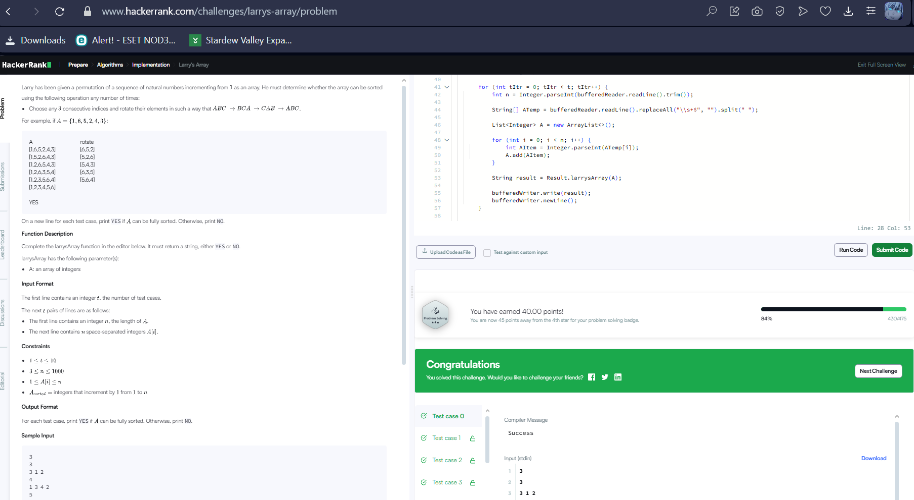

📘 Тайлбар
Зорилго: A массивыг зөвхөн 3 элемент бүхий ямар ч дараалалтай солих (ротац) үйлдлүүд ашиглан өсөх дараалалд оруулж чадах эсэхийг шалгах.

🔍 Логик:
Энэ бодлого нь математикийн inversion count ойлголтыг ашигладаг.

3-rotation үйлдлүүд зөвхөн even permutation (тэгш инверсийн тоотой) массивуудыг бүрэн сорт хийх чадвартай.

Тиймээс хэрвээ өгөгдсөн массивын inversion count тэгш байвал YES, үгүй бол NO.

🧠 Inversion гэж юу вэ?
Хоёр элементийн байрлал алдаатай байвал (жижиг тоо томын дараа байвал) inversion гэж үздэг.

Жишээ:
A = [3, 1, 2]
Inversions: (3,1), (3,2)
Тоо = 2 (even) → YES
🔢 Код хэрхэн ажиллаж байна вэ?
inversions хувьсагчийг 0 гэж онооно.

Массивийн бүх (i, j) хосыг шалгаж A[i] > A[j] байвал inversion гэж тооцно.

Inversion-ийн нийт тоо even бол YES, odd бол NO гэж буцаана.

✅ Жишээ:
Input:

3
3 1 2
Output:

objectivec

YES
Тайлбар: Энэ массив 3 хэмжээтэй тул зөвхөн 3-ротац ашиглаж өөрчлөх боломжтой. Инверсийн тоо 2 (even) тул сорт хийх боломжтой.
int inversions = 0;
inversions гэдэг хувьсагч нь массив доторх бүх "инверси"-ийн (алдаатай байрласан тоо хосуудын) тоог тоолох зориулалттай.

int n = A.size();
n хувьсагч нь массивын нийт элементүүдийн тоо.

for (int i = 0; i < n - 1; i++) {
for (int j = i + 1; j < n; j++) {
if (A.get(i) > A.get(j)) {
inversions++;
}
}
}
Энэ нь O(n²) давталтын блок бөгөөд:

i, j индексийн хос бүрийг шалгана (i < j).

Хэрвээ A[i] > A[j] байвал буруу байрлалд байна гэж үзээд inversions++ хийдэг.

Энэ нь inversion count-ийг олж байгаа хэсэг.

return (inversions % 2 == 0) ? "YES" : "NO";
Хэрвээ инверсины тоо тэгш байвал "YES" буцаана.

Хэрвээ сондгой байвал "NO" буцаана.

Учир нь 3-н ротаци зөвхөн even permutation-уудыг сорт хийх боломжтой.

Жишээ

A = [1, 3, 4, 2]
Inversions: (3,2), (4,2) → 2 инверс
→ inversion count even → “YES”
Энэ код нь "Larry’s Array" бодлогын үндсэн логик дээр тулгуурлан өгөгдсөн массивыг зөвхөн 3-н солилцоогоор сорт хийж болох эсэхийг шалгадаг.
