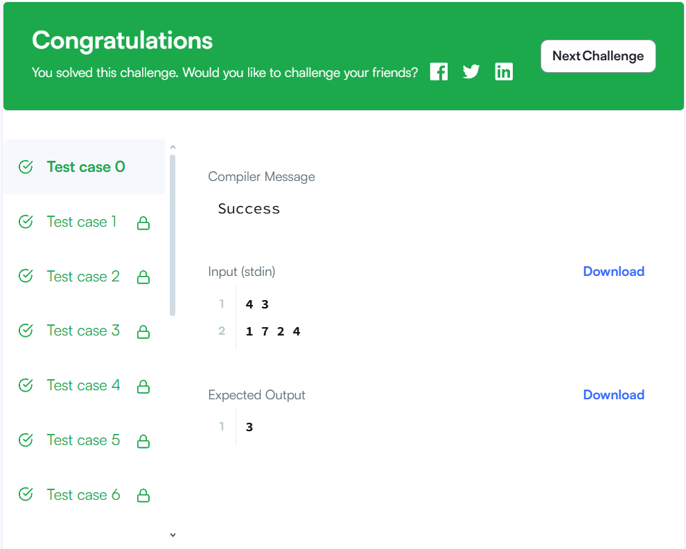

🔍 Даалгаврын гол санаа:
Бид дараах зүйлийг хийх ёстой:

Жагсаалтад байгаа бүх тоонуудыг k-аар хуваагаад үлдэгдлийг нь (num % k) тоолно.

Хэрэв хоёр тооны үлдэгдлийн нийлбэр k бол, тухайн хоёр тооны нийлбэр нь k-аар хуваагдана.

Иймээс ийм хоёр тоог хоёуланг багтааж болохгүй.

🎯 Алгоритмын үндсэн алхмууд:

Үлдэгдэл (modulo k) бүрийг тоолох

int[] count = new int[k];
for (int num : s) {
count[num % k]++;
}
Жишээ: k = 3, s = [1, 7, 2, 4]
Үлдэгдлүүд:

1 % 3 = 1

7 % 3 = 1

2 % 3 = 2

4 % 3 = 1

count[] = [0, 3, 1]

Үлдэгдэл 0-ийг зөвхөн 1 удаа сонгож болно

if (count[0] > 0) {
result++;
}
Учир нь 0 + 0 = 0 → k-аар хуваагдана → 2 эсвэл түүнээс олон 0-ууд байж болохгүй.

Үлдэгдэл i болон k - i хосуудыг харьцуулж, ихийг нь сонгоно

for (int i = 1; i <= k / 2; i++) {
if (i != k - i) {
result += Math.max(count[i], count[k - i]);
}
}
Жишээ:

k = 4 → хосууд: (1,3), (2,2)

i = 1 → count[1] = 3, count[3] = 1 → их нь 3 → сонгоно

i = 2 → i == k - i тул дараагийн алхамд шалгана

Хэрэв k нь тэгш тоо бол k/2 үлдэгдлээс зөвхөн нэг-ийг сонгоно

if (k % 2 == 0 && count[k / 2] > 0) {
result++;
}
Жишээ: k = 4 → k/2 = 2 → 2 + 2 = 4 → хуваагдана → зөвхөн нэг 2 сонгоно.
🧠 Жишээ тайлбар:
k = 3
s = [1, 7, 2, 4]
Үлдэгдлүүд: [1, 1, 2, 1]

count = [0, 3, 1]

Шийдэл:

Үлдэгдэл 0 → байхгүй

i = 1 → max(count[1], count[2]) = max(3,1) = 3

Хариу: 3

✅ result дээр бичсэн зүйлсийг тайлбарлавал:

if (count[0] > 0) result++;
Үлдэгдэл 0 → зөвхөн нэг

for (int i = 1; i <= k / 2; i++) {
if (i != k - i) {
result += Math.max(count[i], count[k - i]);
}
}
Хос үлдэгдлээс ихийг нь сонгоно

if (k % 2 == 0 && count[k / 2] > 0) {
result++;
}
Тэгш тооны хагас үлдэгдэл (k/2) → зөвхөн нэг

✨ Дүгнэлт:
Үлдэгдлүүдийн хослол дээр тулгуурласан логик.

count[] массивыг ашиглан хамгийн их боломжит subset-г олох.

Уламжлалт хосын шалгалт биш, mod дээр тулгуурласан optimal solution.

