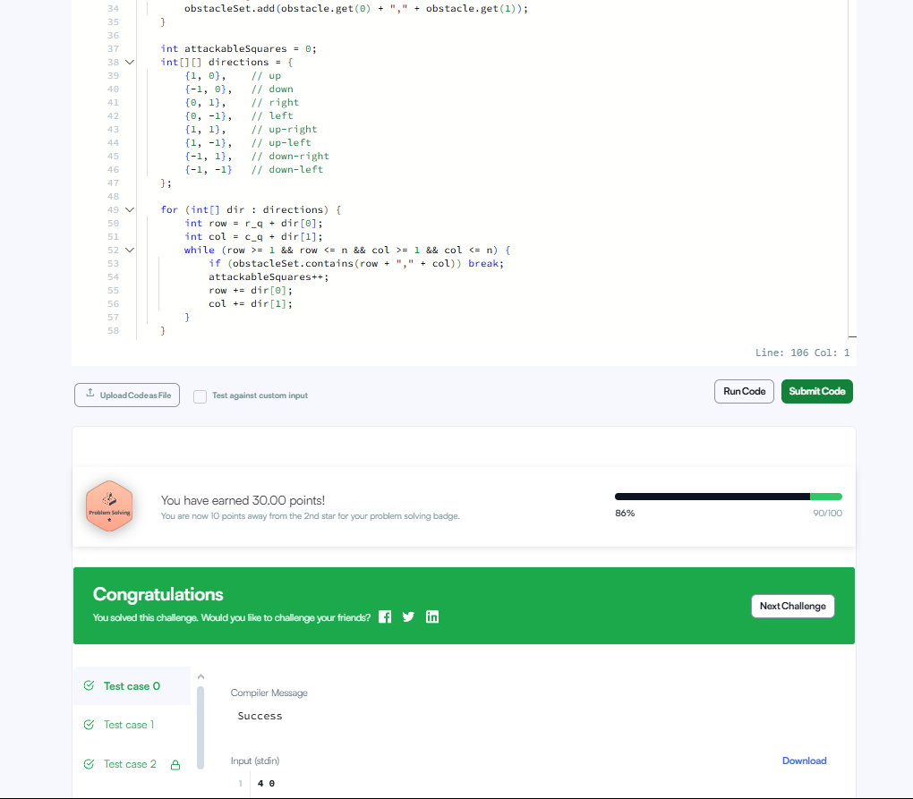

💡 Тайлбар

Queen-ийн хөдөлгөөн
Queen 8 чиглэлд хөдөлж чадна:
↑ Up

↓ Down

→ Right

← Left

↗ Up-right

↖ Up-left

↘ Down-right

↙ Down-left

Обстаклуудыг хадгалах
Обстаклуудыг Set хэлбэрээр "row,col" форматаар хадгалсан.
Учир нь Set-ээс хайлт хийх нь хурдан (O(1)).

Чиглэл бүрээр алхах
Тус бүрт дараалсан coordinate руу алхах.
Хэрэв:

Обстакл таарвал зогсоно

Самбарын хил хязгаараас гарвал зогсоно

Алхалт бүр бүртгэгдэнэ (attackableSquares++).

📦 Жишээ:
Input:

n = 5, k = 3
queen = (4, 3)
obstacles = [[5, 5], [4, 2], [2, 3]]

10
Тайлбар:

Обстаклгүй байсан бол queen нийт 27 square рүү довтолж болох байсан.

Харин дээрх 3 обстакл хэд хэдэн чиглэлийг хязгаарлаж, эцсийн хариу 10 болж байна.

🧠 Давуу тал:
Memory-efficient: Самбарын бүх координатыг хадгалах шаардлагагүй.

Time-efficient: Зөвхөн 8 чиглэлээр алхдаг.
