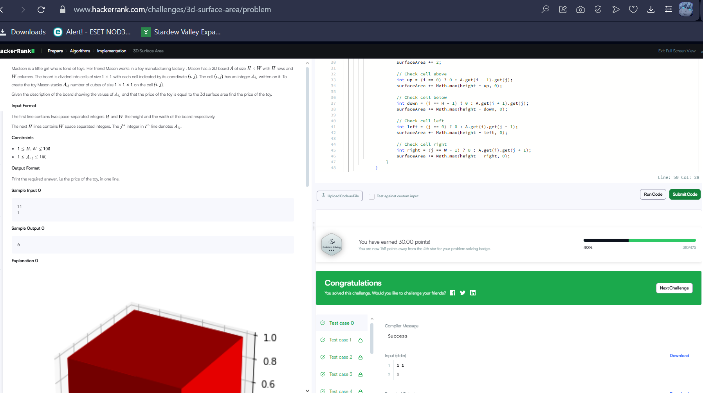

Энэ код нь 3D шоо хэлбэрийн объектын нийт гадаргуугийн талбайг тооцож байна.
Босоо тэнхлэгээр байрласан HxW хэмжээтэй торон дээр байрлах шоо бүрийн өндөр өгөгдсөн.
Талбайг тооцоход:

Шоо бүрийн дээш болон доош талыг нэмнэ (2 тал).

Тус бүрийн дөрвөн хажуу талыг хөрштэй нь харьцуулж, өндөрний ялгаанаас үүдэлтэй гадаргуугийн хэмжээг нэмнэ.

Хөрш байхгүй талд тухайн шооноос өндөр хэмжээгээр нэмнэ.
Ингэснээр нийт гадаргуугийн талбайг зөв тооцно.

Хэмжээ авна

int H = A.size();
int W = A.get(0).size();
H: матрицын мөр буюу өндөр.

W: багана буюу өргөн.

Нийт гадаргуугийн талбай хадгалах хувьсагч

int surfaceArea = 0;
Гадаргуугийн талбайг тооцоход ашиглагдана.

Давталтаар бүх шоо (x, y) цэг дээр очно

for (int i = 0; i < H; i++) {
for (int j = 0; j < W; j++) {
int height = A.get(i).get(j);
height: тухайн байрлал дахь шоо хэр өндөр болохыг хадгална.

Хэрвээ шоо байвал тооцоолол хийнэ

if (height > 0) {
surfaceArea += 2;
Хэрвээ шоо байгаа бол дээд болон доод тал нь ил тул 2 нэгж гадаргуу нэмнэ.

Дөрвөн талын хөрштэй харьцуулж ялгаа тооцно

int up = (i == 0) ? 0 : A.get(i - 1).get(j);
surfaceArea += Math.max(height - up, 0);
Хойд талд хөрш байхгүй бол 0 гэж үзнэ. Хэрвээ өндөр нь хөршөөсөө илүү байвал ялгааг гадаргуу болгон нэмнэ.

int down = (i == H - 1) ? 0 : A.get(i + 1).get(j);
surfaceArea += Math.max(height - down, 0);
Урд тал дээрх хөрштэй ижил үйлдэл хийнэ.

int left = (j == 0) ? 0 : A.get(i).get(j - 1);
surfaceArea += Math.max(height - left, 0);
Зүүн талын хөрштэй харьцуулж ялгааг нэмнэ.

int right = (j == W - 1) ? 0 : A.get(i).get(j + 1);
surfaceArea += Math.max(height - right, 0);
Баруун талын хөрштэй ижил аргаар ялгааг нэмнэ.

Эцэст нь нийт гадаргуугийн талбайг буцаана

return surfaceArea;
Энэ алгоритм нь нэг бүрэн шоо бүрийн 6 гадаргуунаас хөрш шоо байвал давхардсан гадаргууг хасах зарчим дээр тулгуурласан бөгөөд зөвхөн харагдах талуудыг тооцож гаргадаг.

