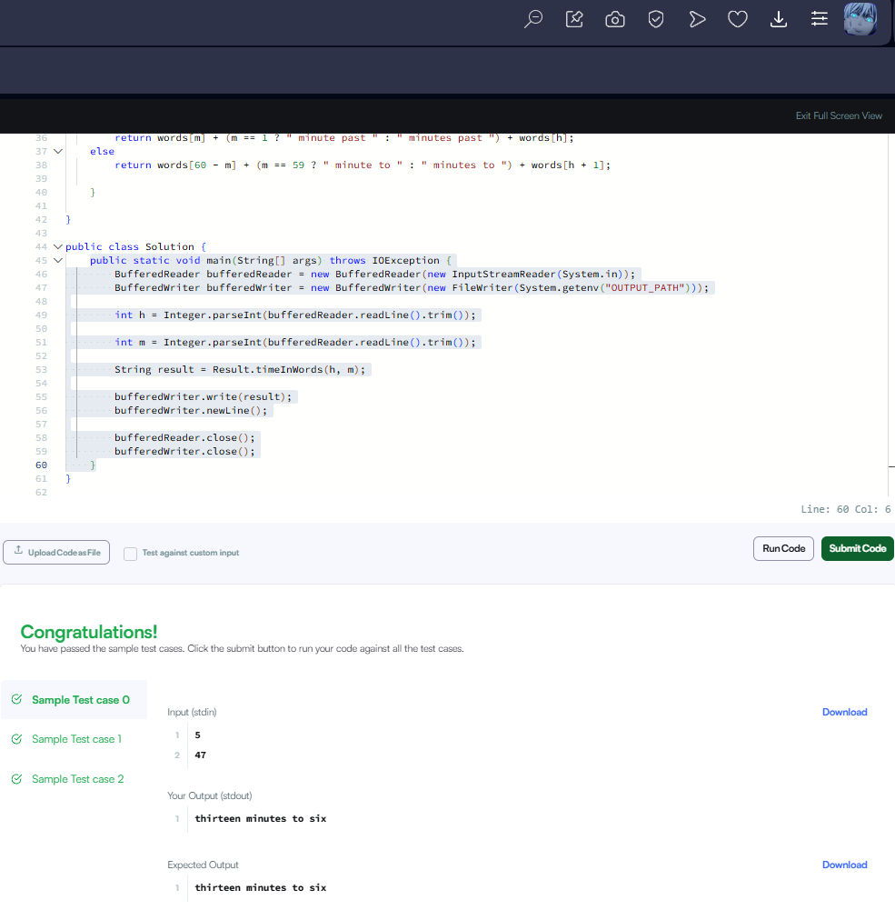

🧠 Тайлбар:
words[] массив нь 1-29 хүртэлх тоонуудыг үгээр илэрхийлсэн массив бөгөөд "time in words" бодлого хийхэд ашиглагддаг.

if (m == 0) — минут 0 бол “x o’ clock” хэлбэрээр буцаана.

else if (m == 15) — 15 минут бол “quarter past x”.

else if (m == 30) — 30 минут бол “half past x”.

else if (m == 45) — 45 минут бол “quarter to x+1”.

else if (m < 30) — 1-29 минутын хооронд бол “x minutes past h”.

else — 31-59 минутын хооронд бол “x minutes to h+1”.

🧾 Жишээ:
Input:
5
47

Output:
thirteen minutes to six

Input:
3
00

Output:
three o' clock

Input:
7
15

Output:
quarter past seven

🧩 Дүгнэлт:
Энэ код нь өгөгдсөн цаг болон минутын утгыг англи үгээр хэрхэн зөв дүрслэхийг шийддэг. Минутаар нөхцөлдөн цагийн дүрслэлийг өөрчилдөг хэд хэдэн нөхцөлтэй бөгөөд минутын утга 30-аас хэтэрсэн үед дараагийн цаг руу шилждэг
words массив нь 1-ээс 29 хүртэл бүх тоог текст хэлбэрээр хадгалж байгаа. Энэ нь минут болон цагийг англиар үгээр буцаахад хэрэгтэй.

Хэрэв минут нь 0 бол, яг цаг дээр байгаа гэсэн үг бөгөөд "x o' clock" гэсэн хэлбэртэй текстийг буцаана. Жишээ нь: 5:00 бол “five o' clock”.

Хэрэв минут нь 15 байвал энэ нь "quarter past" буюу 15 минут өнгөрсөн гэсэн утгатай. Жишээ нь: 5:15 бол “quarter past five”.

Хэрэв минут нь 30 байвал энэ нь "half past" буюу хагас цаг өнгөрсөн гэсэн үг. Жишээ нь: 5:30 бол “half past five”.

Хэрэв минут нь 45 бол энэ нь дараагийн цаг хүртэл 15 минут дутуу гэсэн утгатай тул "quarter to x+1" хэлбэртэйгээр буцаана. Жишээ нь: 5:45 бол “quarter to six”.

Хэрэв минут 1-ээс 29 хооронд байвал "x minutes past h" гэсэн хэлбэртэйгээр буцаагдана. Харин минут нь 1 бол “minute” гэдэг үгийг ганцаарчилна.

Харин минут 31-ээс 59 хооронд байвал "x minutes to h+1" хэлбэртэй буцаана. 60-аас тухайн минутыг хасаж, дараагийн цагийг ашиглаж текст үүсгэнэ. Хэрэв 59 бол “minute” гэдэг үгийг ганцаарчилна.

Энэ код нь цаг, минутын утгыг тухайн нөхцөлөөс шалтгаалж англи хэлээр зөв буцаадаг логиктой бөгөөд Hackerrank-ийн "The Time in Words" бодлогын бүх нөхцөлийг бүрэн хамарсан.

